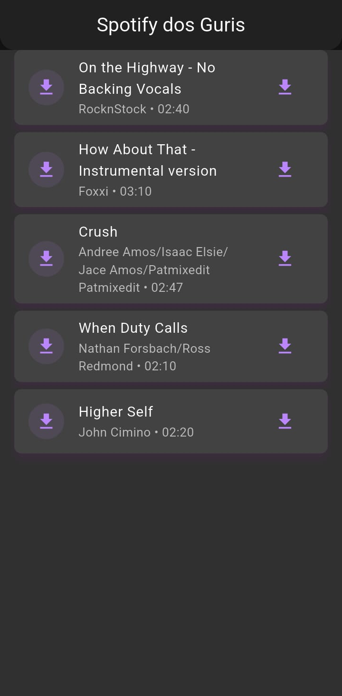

# MP3 Player Flutter 🎵

## 📱 Descrição Geral

O **MP3 Player Flutter** é um aplicativo desenvolvido para Android com o objetivo de baixar e reproduzir uma playlist de músicas MP3 obtida de um servidor remoto. Ele acessa um arquivo JSON hospedado online que contém as informações das faixas, faz o download dos arquivos e permite a reprodução das músicas de forma progressiva, ou seja, o áudio começa a tocar antes do término completo do download.

---

## 🧠 Funcionamento do Aplicativo

O aplicativo é estruturado com base na arquitetura **MVVM (Model-View-ViewModel)** e utiliza **providers** para gerenciar dependências e estados.

* **AudioService**: é o serviço responsável por controlar a reprodução das músicas. Ele gerencia o player de áudio, incluindo as ações de play, pause, stop, além de lidar com o buffer e o controle da reprodução em segundo plano. Também é ele quem envia informações à notificação persistente exibida enquanto a música toca.

* **DownloadService**: é o serviço encarregado de baixar as músicas a partir do link definido no JSON. Ele faz o gerenciamento do download em segundo plano, garantindo que os arquivos sejam salvos localmente e que downloads interrompidos possam ser retomados. Esse serviço também atualiza o estado do download (baixando, pausado, concluído, erro) exibido na interface.

Ambos os serviços trabalham de forma independente, mas se comunicam por meio de **Providers**, permitindo que o aplicativo continue funcionando mesmo em segundo plano, sem travar ou consumir recursos de maneira excessiva.

---

## 🎶 Reprodução com Streaming Progressivo

Durante o download, o app preenche um **buffer inicial** antes de iniciar a reprodução. Assim que há dados suficientes, o áudio começa a tocar imediatamente. Caso o buffer se esvazie por problemas de rede, a música é pausada automaticamente e retomada assim que novos dados chegam. Esse mecanismo garante uma experiência fluida mesmo durante conexões instáveis.

---

## 🔔 Notificação Persistente e Execução em Segundo Plano

Enquanto a música está tocando, o aplicativo mantém uma **notificação persistente** no dispositivo. Essa notificação exibe o título e o autor da faixa atual, além de botões de controle (play, pause e stop). Mesmo que o aplicativo seja minimizado ou a tela desligada, a reprodução continua normalmente graças ao serviço em segundo plano.

---

## 🧩 Interface e Experiência do Usuário

A interface principal apresenta uma lista das músicas obtidas do JSON, exibindo:

* O título e o autor de cada faixa.
* O estado de download e buffer em tempo real.
* Uma barra de progresso mostrando o andamento do download.

O design foi desenvolvido com **Material Design 3**, adotando temas claro e escuro que se ajustam automaticamente ao sistema. Cores vibrantes foram utilizadas para destacar elementos principais, garantindo uma experiência moderna e acessível.

O app também inclui **labels de acessibilidade** (TalkBack) e prepara as strings para futuras traduções, facilitando a internacionalização (i18n).

---

## 🖼️ Imagens do Aplicativo

O projeto inclui duas imagens principais:

* **music1.png**: utilizada na tela inicial como capa da playlist, representando visualmente o conjunto de músicas disponíveis.
* **music2.png**: exibida durante a reprodução da música, simbolizando a música em execução e compondo o visual do player.

---

## ⚙️ Recursos Adicionais

O aplicativo também possui as seguintes funcionalidades:

* Reprodução aleatória das músicas (modo randômico);
* Opção de repetição de uma ou todas as faixas;
* Tratamento de falhas de rede com mensagens de erro claras ao usuário;
* Retomada automática de downloads interrompidos;
* Liberação correta de recursos após o término da reprodução (uso de dispose);
* Execução do player mesmo com a tela desligada, por meio de serviço em foreground.

---

## 📄 Estrutura do Projeto

* **main.dart**: ponto de entrada do aplicativo e configuração principal dos temas e provedores.
* **audio_service.dart**: controle da reprodução e integração com o sistema de notificações.
* **download_service.dart**: gerenciamento dos downloads e comunicação com o JSON remoto.
* **home_screen.dart**: interface principal, exibe a lista de músicas e o estado do player.

---

## 🌐 Fonte dos Dados

Os dados da playlist são obtidos a partir do seguinte link remoto:

> [https://www.rafaelamorim.com.br/mobile2/musicas/list.json](https://www.rafaelamorim.com.br/mobile2/musicas/list.json)

---

## ✅ Conclusão

O **MP3 Player Flutter** é um aplicativo completo que demonstra boas práticas de desenvolvimento mobile moderno, unindo **reprodução de mídia em streaming progressivo**, **downloads em segundo plano**, **notificações persistentes** e **acessibilidade** em uma interface moderna e fluida. É um exemplo funcional de integração entre múltiplos serviços e camadas em um projeto Flutter profissional.
